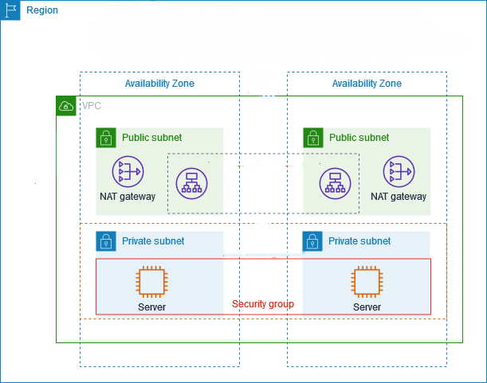

# 🌐 AWS VPC Networking with Terraform

This project provisions a **highly available AWS VPC network** using Terraform.  
The setup includes **public and private subnets across 2 Availability Zones**, NAT Gateways for outbound internet access, and EC2 instances in private subnets protected by Security Groups.  

---

## 📌 Architecture

The infrastructure follows this design:



---

## ⚙️ Features
- VPC with CIDR `10.0.0.0/16`
- 2 **Public Subnets** (one per Availability Zone)
- 2 **Private Subnets** (one per Availability Zone)
- **Internet Gateway** for public subnet access
- **NAT Gateways** in public subnets for outbound internet from private instances
- **Route Tables** for public and private subnets
- **Security Group** for private servers
- 2 **EC2 Instances** inside private subnets

---

## 🚀 Getting Started

### 1️⃣ Prerequisites
- [Terraform](https://developer.hashicorp.com/terraform/downloads) installed  
- AWS credentials configured (`~/.aws/credentials` or environment variables)  
- Git installed  

### 2️⃣ Clone the Repo
```bash
git clone https://github.com/vaibhav8485/Network.git
cd Network/Project
