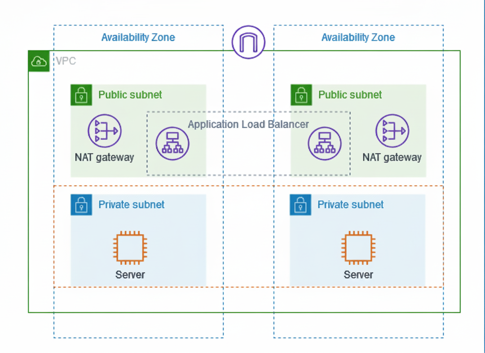

# AWS VPC Infrastructure Automation (Terraform + Bash)

---

## 📌 Architecture

The infrastructure follows this design:



---

## 🧩 Overview
This project automates creation of a multi-AZ AWS VPC using Terraform, wrapped in a Bash script for a fully hands-free deployment experience.

## ⚙️ Stack
- Terraform
- AWS CLI
- Bash

## 🧱 Infrastructure Created
- 1 VPC (10.0.0.0/16)
- 4 Subnets (2 public, 2 private)
- Internet Gateway + NAT Gateways
- Route Tables + Associations
- Security Group
- 2 EC2 Instances (Private Subnets)

## 🚀 Usage
```bash
chmod +x deploy_infra.sh
./deploy_infra.sh
